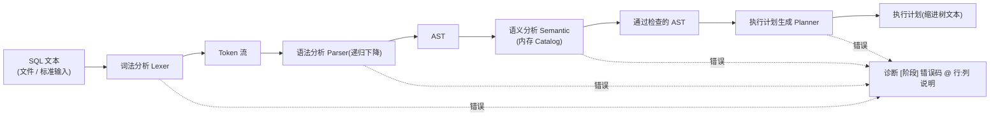

# cella SQL 编译器（cella_sql）

cella 教学数据库系统的 **SQL 编译器前端**：把 cella 方言的 SQL 文本编译为**执行计划**。
纯 C++17 标准库实现，无任何第三方依赖（不用 flex/bison/ANTLR/boost）。



规格依据：`cella_prompt/cella_sql_agent_prompt.md`（本工程的“宪法”），概念背景见 `cella_prompt/keyword_design.md`。

## 目录结构

```
.
├─ CMakeLists.txt                 # C++17，可执行名 cella_sql
├─ grammar.md                     # 文法设计文档（EBNF/优先级/AST/Plan 说明）
├─ include/cella/
│   ├─ cella_common.h             # CELLA_Error 统一诊断、字符串工具
│   ├─ cella_token.h              # Token 枚举/结构、关键字总表
│   ├─ cella_lexer.h              # 词法分析接口
│   ├─ cella_ast.h                # AST 节点定义（含表达式深拷贝）
│   ├─ cella_parser.h             # 语法分析接口
│   ├─ cella_catalog.h            # 内存目录（表/列）
│   ├─ cella_semantic.h           # 语义分析接口（含表达式类型系统）
│   ├─ cella_planner.h            # 执行计划生成接口
│   ├─ cella_optimizer.h          # 计划优化接口（常量折叠/布尔化简/恒真 Filter 消除）
│   └─ cella_printer.h            # Token/AST/计划 文本打印
├─ src/
│   ├─ main.cpp                   # CLI 入口
│   ├─ cella_lexer.cpp
│   ├─ cella_parser.cpp
│   ├─ cella_semantic.cpp
│   ├─ cella_planner.cpp
│   ├─ cella_optimizer.cpp
│   └─ cella_printer.cpp
└─ tests/
    ├─ sql/ok_*.sql               # 正向用例（7 个）
    ├─ sql/err_*.sql              # 负向用例（13 个，首行注释标注期望错误码）
    ├─ expected/ok_*_plan.txt     # -p 输出 golden
    └─ run_tests.ps1              # 回归脚本
```

> 说明：根目录原有骨架 `cella_lex.cpp` 的 `CELLA_` 命名风格已延续到 `include/cella/` 头文件，
> 其内容并入 `src/cella_lexer.cpp` 后原文件已删除。

## 构建与运行

### 方式一：MinGW-w64 g++（本机已装 g++ 13.1）

```
cmake -G "MinGW Makefiles" -S . -B build
cmake --build build
```

产物：`build\cella_sql.exe`

### 方式二：Visual Studio MSVC

```
cmake -S . -B build
cmake --build build --config Debug
```

产物：`build\Debug\cella_sql.exe`

## CLI 用法

```
用法: cella_sql [选项] [文件]
  -l, --lex      仅词法分析，输出 Token 流
  -a, --ast      词法+语法，输出 AST
  -s, --sem      执行到语义分析并输出各语句语义结论
  -p, --plan     输出执行计划（默认值：不加选项即此行为）
  -o, --opt      输出优化前/后执行计划对比（常量折叠、布尔化简、恒真 Filter 消除）
      --all      依次打印 词法→AST→语义→计划→优化后计划 全阶段
  -h, --help     帮助
```

- 省略文件时从标准输入读取（Windows 下 Ctrl+Z 结束）。
- 一次输入可包含多条语句（`;` 分隔），按顺序处理；一条出错不影响后续语句。
- 退出码：`0`=全部成功；`1`=存在任意阶段错误；`2`=用法错误。
- 所有诊断走同一条输出通道（stdout），格式 `[阶段] 错误码 @ 行:列 说明`。

## 语言规格摘要（cella 方言）

- 关键字与标识符**大小写不敏感**；关键字为保留字，不能作表名/列名。
- 注释：`-- 行注释`、`/* 块注释 */`（可跨行、不嵌套）。
- 运算符：`= == != <> < <= > >= + - * /`（`==` 等价于 `=`，`<>` 等价于 `!=`）。
- 字符串：单引号 `'...'`，内部 `''` 转义（不支持 `\`）；内容形如 `YYYY-MM-DD` 时值类别为 DATE。
- 数据类型：`INT`(=INTEGER) `FLOAT` `DOUBLE` | `CHAR` `VARCHAR` `TEXT`（省略长度默认 255）| `DATE` `TIME` `DATETIME`。
- DDL/DML 用标准 SQL 关键字，DQL 用 cella 自定义词：

| cella | 标准 SQL | | cella | 标准 SQL |
|---|---|---|---|---|
| `get` | SELECT | | `join`/`on` | JOIN/ON |
| `in` | FROM | | `left`/`right`/`middle` | LEFT/RIGHT/INNER JOIN |
| `limit` | WHERE | | `union` | UNION |
| `grouped` | GROUP BY | | `distinct` | DISTINCT |
| `having` | HAVING | | `as` | AS |
| `ordered` | ORDER BY | | `among` | LIMIT 行数 |
| `page` | 分页（页码, 每页行数） | | | |

> `page` 与 `among` 可同用：`among` 先限定总行数，`page` 再在其内分页；分页起始行超出 `among` 范围时报 SEM-312。

- 查询子句顺序固定：`get [distinct] 列 in 表 [join...] [limit] [grouped] [having] [ordered] [among] [page 页码[,每页行数]] [union get...] ;`
- DELETE/UPDATE 的过滤条件用 `limit`（已彻底移除 FROM/WHERE：`DELETE in student limit ...`、`UPDATE student SET ... limit ...`）。

冒烟示例（全部合法）：

```sql
CREATE TABLE student(id INT, name VARCHAR, age INT);
INSERT INTO student(id,name,age) VALUES (1,'Alice',20);
get id,name in student limit age > 18;
DELETE in student limit id = 1;
```

## 输出图例

### Token 流（`-l`）

```
1:1   KEYWORD        CREATE
1:15  IDENTIFIER     student
1:26  CONST(NUMBER)  1
1:44  CONST(STRING)  'Alice'
1:60  CONST(DATE)    '2024-02-20'
2:1   DELIMITER      ;
EOF
```

### AST（`-a`）

```
Program
  CreateTableStmt @1:1  name=student
    columns:
      id  INT
      name  VARCHAR(255)
      age  INT
  InsertStmt @2:1  table=student  columns=[id,name,age]
    rows:
      (1,'Alice',20)
  GetStmt @3:1  select=[id,name] from=[student]
    limit: age > 18
  DeleteStmt @4:1  table=student
    limit: id = 1
```

### 语义（`-s`）

```
[语义] OK: 语句#1 CREATE TABLE student（列: id, name, age）
[语义] OK: 语句#2 INSERT INTO student
[语义] OK: 语句#3 get in student
[语义] OK: 语句#4 DELETE student
```

### 执行计划（`-p`，默认）

```
CreateTable
  table: student
  columns: id INT, name VARCHAR(255), age INT

Insert
  table: student
  columns: id, name, age
  rows: [1, 'Alice', 20]

Project [id, name]
  Filter (age > 18)
    SeqScan [student]

Delete (filter: id = 1)
  SeqScan [student]
```

扩展算子示例（`get s.name, c.title in student s middle join course c on s.cid = c.id ordered s.name asc among 10;`）：

```
Limit (10)
  Sort (s.name ASC)
    Project [s.name, c.title]
      Join (middle on s.cid = c.id)
        SeqScan [student s]
        SeqScan [course c]
```

### 计划优化（`-o`，三条规则）

> 说明：AST 忠实反映语法结构，常量折叠发生在**计划优化**阶段——`-p`/`--all` 的“计划”段为未优化计划，
> `-o` 展示优化前后对比，`--all` 在计划段之后追加 `== 优化后 ==` 段。

```
== 优化前 ==
Project [name]
  Filter (1 = 1 AND age > 10 + 8)
    SeqScan [student]

== 优化后 ==
Project [name]
  Filter (age > 18)
    SeqScan [student]
```

1. **常量折叠**：`age > 10 + 8` → `age > 18`；`1 = 1` → `TRUE`。
2. **布尔化简**：`x AND TRUE`→`x`；`x OR FALSE`→`x`；`x AND FALSE`→`FALSE`；`x OR TRUE`→`TRUE`。
3. **恒真 Filter 消除**：谓词折叠为 `TRUE` 时删除 Filter 节点（`get id in t limit 1 = 1` 直接变为 SeqScan+Project）。

优化作用范围：get 链中的 `Filter(limit/having)` 与 `Join(on)`；除零时放弃折叠；保证语义等价。

## 表达式类型系统（语义阶段）

| 操作 | 规则 | 结果类型 |
|---|---|---|
| `+ - * /` | 两侧均数值（INT/FLOAT/DOUBLE） | INT < FLOAT < DOUBLE 提升 |
| `+ - * /` | 任一侧非数值（如 `18 + 'abc'`） | 报 SEM-309 |
| 比较 | 数值-数值 / 字符串-字符串 / 日期-日期 / BOOL-BOOL | BOOL |
| 比较 | 跨族（如 INT 与 VARCHAR） | 报 SEM-309 |
| `AND`/`OR` | 两侧必须 BOOL | BOOL |
| `NOT` | 操作数必须 BOOL | BOOL |
| 一元 `-` | 操作数必须数值 | 数值 |

`limit`/`on`/`having` 及 DML 的 `limit` 条件结果必须为 BOOL，否则报 SEM-310（例：`limit age`、`limit id`）。

## 错误码

| 阶段 | 错误码 | 说明 |
|---|---|---|
| 词法 | LEX-101 | 非法字符 |
| 词法 | LEX-102 | 未闭合的字符串字面量 |
| 词法 | LEX-103 | 数字格式错误（如 1.2.3） |
| 词法 | LEX-104 | 未闭合的块注释 |
| 语法 | SYN-201 | 意外 Token（含“期望/实际”） |
| 语法 | SYN-202 | 语句缺少分号 `;` 结尾 |
| 语义 | SEM-301 | 表不存在 |
| 语义 | SEM-302 | 表已存在，重复定义 |
| 语义 | SEM-303 | 列不存在 / 限定表不在范围 |
| 语义 | SEM-304 | 建表列名重复 |
| 语义 | SEM-305 | INSERT 值个数与列个数不一致 |
| 语义 | SEM-306 | 常量与列类型不匹配 |
| 语义 | SEM-307 | 向 NOT NULL 列插入 NULL |
| 语义 | SEM-308 | 重名列未用 表名.列名 限定 |
| 语义 | SEM-309 | 操作符不能应用于两侧类型（如 INT+VARCHAR） |
| 语义 | SEM-310 | 条件表达式必须为 BOOL |
| 语义 | SEM-311 | 分页参数必须为正整数（page 页码/每页行数） |
| 语义 | SEM-312 | 分页与 among 冲突（起始行超出 among 限定范围） |
| 计划 | PLN-401 | 不支持的语句类型（防御性） |

## 测试

```
powershell -ExecutionPolicy Bypass -File tests\run_tests.ps1
```

- 正向（`ok_*.sql`，11 个）：`-a -s -p` 退出码必须为 0，且 `-p` 输出与 `tests/expected/ok_*_plan.txt` golden 完全一致。
- 优化（`ok_opt_*.sql`）：额外比对 `-o` 输出与 `tests/expected/ok_opt_*_opt.txt`。
- 负向（`err_*.sql`，16 个）：`--all` 退出码必须为 1，且输出包含首行注释 `-- expect: 错误码` 声明的错误码。
- 覆盖点：缺分号、未闭合字符串、非法字符、未定义表、列拼写错误、类型不匹配（INSERT/运算/条件）、值个数不一致、重复建表、重复列名、保留字作标识符、limit 列不存在、NULL→NOT NULL、大小写混合、空输入、join/union/distinct/grouped/having/ordered/among、UPDATE/DROP TABLE、优化规则 golden。
- 捕获方式：通过 `cmd` 重定向取原始字节再按 UTF-8 读取，避免控制台代码页造成乱码。

## 实现决策与偏差说明

1. 旧骨架 `cella_lex.cpp` 已并入 `src/cella_lexer.cpp` 后删除，命名风格与 `CELLA_` 前缀沿用。
2. `get *` 不生成 `Project` 算子（README 已说明，见 3.4 节自洽要求）。
3. `Delete(filter)` 与 `Update` 均以 `SeqScan` 为子节点打印（对齐任务书第 7 节样例）。
4. 类型兼容采用简化规则：NUMBER→INT/FLOAT/DOUBLE；STRING→CHAR/VARCHAR/TEXT/TIME/DATETIME；DATE 字面量→DATE；NULL→任意类型（受 NOT NULL 约束）；TRUE/FALSE 无对应列类型（恒报 SEM-306）。
5. UNION 两臂不做列数/列序一致性校验（任务书未强制，此处简化）。
6. 诊断统一输出到 stdout（任务书要求“统一走一条输出通道”）。
7. v2 新增（与 guide.md 对照补齐）：表达式类型系统（SEM-309/310）、计划优化器（常量折叠/布尔化简/恒真 Filter 消除，`-o` 展示前后对比）、`==` 运算符、`grammar.md` 文法文档。
8. 标准 `SELECT...FROM...WHERE` 语法不做兼容（用户确认仅 cella 方言）。
9. `--halt`、`--format=sexpr|json`、`IS NULL`、指数记数法、DECIMAL、Fuzz 测试为规格可选项，未实现。
10. 文件头部的 UTF-8 BOM 会被词法器自动跳过；行尾兼容 CRLF/LF。
